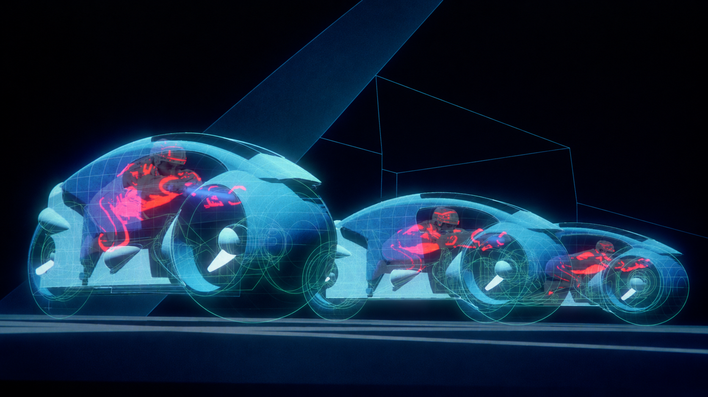
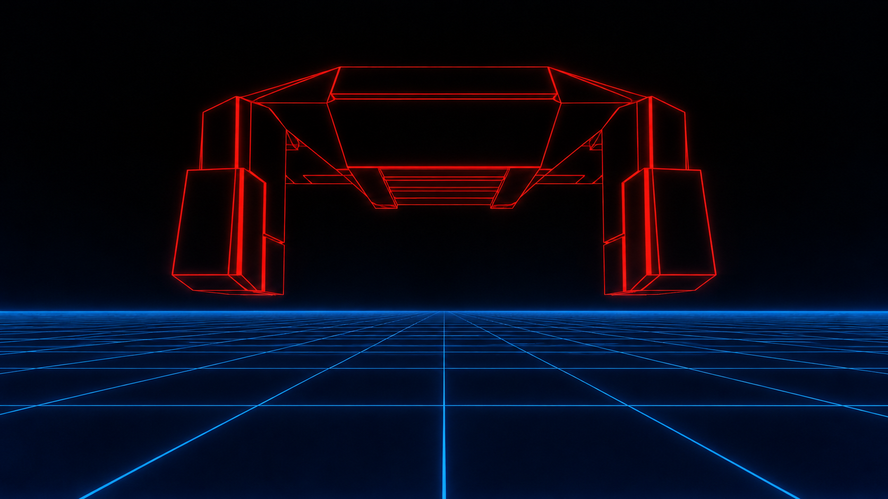
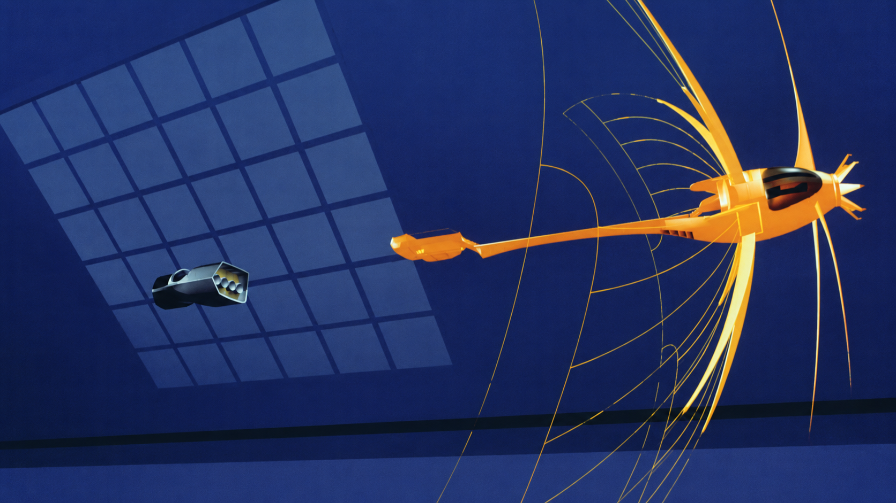
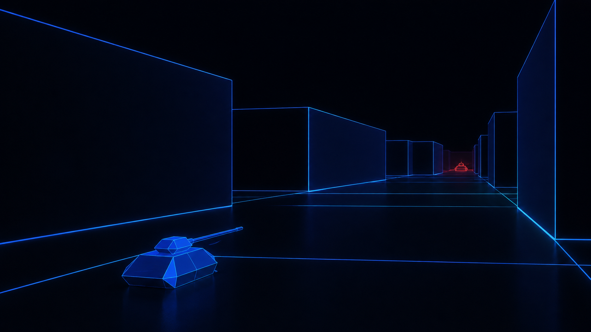
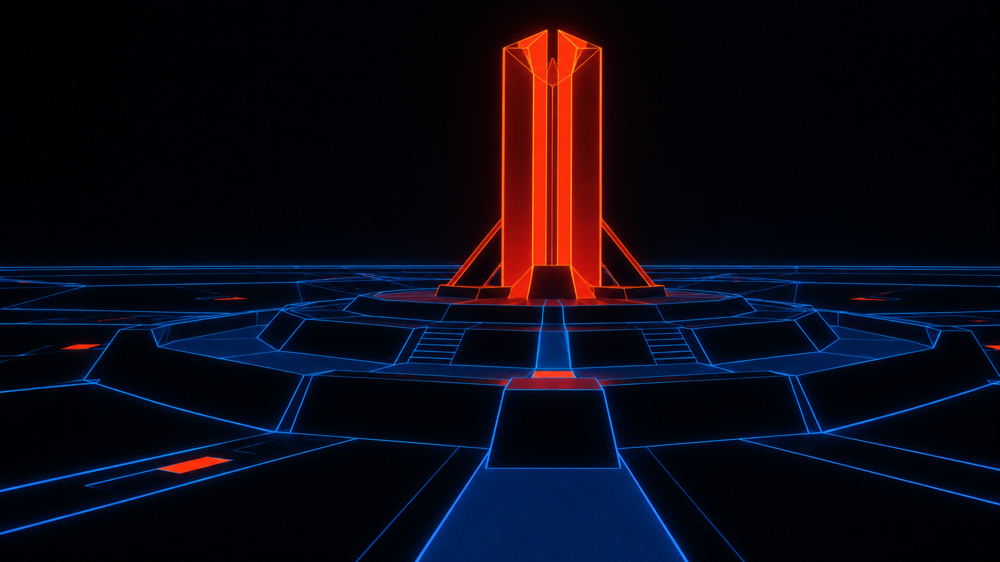
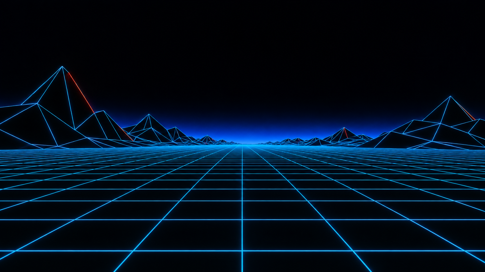

<div align="center">

# Tron'82 · Omarchy

**Black space. Blue grids. Light in motion.**

An Omarchy theme inspired by the pioneering computer graphics of *TRON* (1982).




</div>

## The look

Near-black surfaces, icy cyan highlights, cobalt borders, and restrained amber/red accents. Six coordinated backgrounds explore the original film’s simple faceted forms, luminous edges, and vast electronic spaces.

The backgrounds are original AI-generated interpretations made with OpenAI’s built-in image generation tool. They are wallpaper previews, not desktop screenshots or extracted film frames. Each PNG is **1672 × 941**. The complete prompt set is included in [prompts.json](prompts.json).

## Install

```bash
omarchy theme install https://github.com/adampog/omarchy-tron-82-theme
```

Or open the Omarchy menu, choose **Install → Style → Theme**, and paste this repository’s URL.

Switch back to the installed theme at any time:

```bash
omarchy theme set tron-82
```

## Choose a background

Press **Super + Ctrl + Space** to open Omarchy’s background picker, or cycle to the next image:

```bash
omarchy theme bg next
```

These are six backgrounds for one theme; no workspace rules or assignments are required.

## Wallpaper gallery

| Light cycle arena | Recognizer |
| :---: | :---: |
|  |  |
| **Solar sailer** | **Tank maze** |
|  |  |
| **Master Control Program** | **Electronic landscape** |
|  |  |

## Palette

| Role | Color |
| --- | --- |
| Background | `#050A10` |
| Raised surface | `#0D1C2A` |
| Foreground | `#D5F3FF` |
| Cyan accent | `#61DFFF` |
| Blue | `#529EFF` |
| Amber | `#FFD45A` |
| Orange | `#FF9B45` |
| Red | `#FF6565` |
| Selection | `#123952` |

Terminal success, warning, and error colors remain distinct. The active window border blends cyan into blue; inactive borders use a subdued blue-gray.

## What is included

- [`colors.toml`](colors.toml): commented palette and window border colors.
- [`icons.theme`](icons.theme): Yaru-blue icon selection.
- [`backgrounds/`](backgrounds/): six numbered wallpapers in cycle order.
- [`prompts.json`](prompts.json): image generation prompts for all six scenes.

Omarchy generates its supported application configurations from `colors.toml`. The exact set of themed applications depends on your installed Omarchy version. This repository needs no custom scripts, plugins, or executable theme configuration.

## Compatibility and customization

Designed for current Omarchy installations that support `colors.toml` and the `omarchy theme` commands. The palette was applied locally and Hyprland reloaded without configuration errors. Older versions with different theme formats have not been tested.

Edit `~/.config/omarchy/themes/tron-82/colors.toml`, then run `omarchy theme set tron-82` to apply your changes. Keep a copy of edits before updating or reinstalling the theme.

Add personal backgrounds under `~/.config/omarchy/backgrounds/tron-82/` to keep them separate from the repository’s images.

See the [Omarchy theme guide](https://omarchy.org/manual/making-your-own-theme/) for the theme format and the [themes manual](https://omarchy.org/manual/themes/) for desktop controls.

## Credits and license

Created by [adampog](https://github.com/adampog). Inspired by the visual world of *TRON* (1982); this is an unofficial fan theme, with no affiliation or endorsement.

The original configuration, documentation, and contributions in this repository are provided under the [MIT License](LICENSE). The included wallpapers are AI-generated; the license applies only to rights the contributor can grant. It does not grant rights to third-party trademarks, characters, or other underlying intellectual property.
