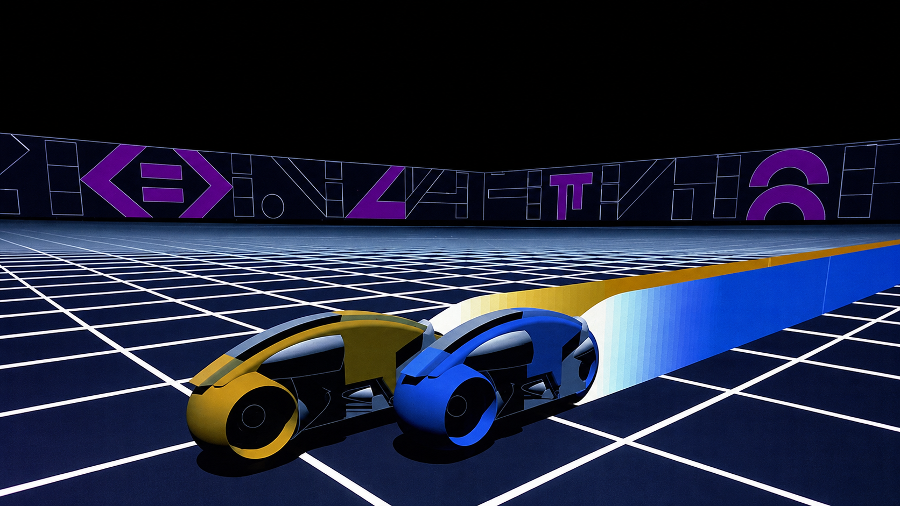
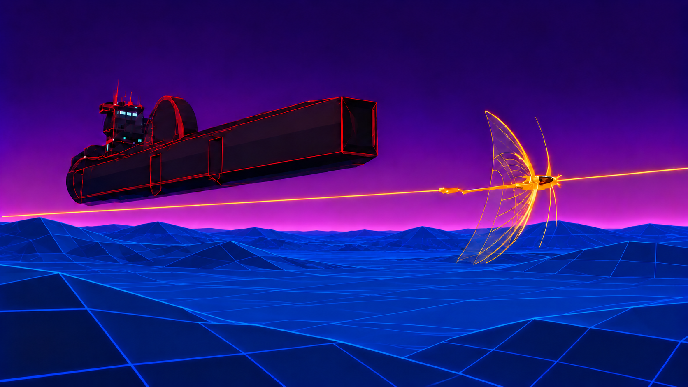

<div align="center">

# Tron'82 · Omarchy

**Black space. Blue grids. Light in motion.**

An Omarchy theme inspired by the pioneering computer graphics of *TRON* (1982).


</div>

## The look

Near-black surfaces, icy cyan highlights, cobalt borders, and restrained amber/red accents. Seven reference-guided backgrounds recreate specific 1982 CGI compositions: materializing light cycles, the Recognizer, the golden solar sailer, a tank, the MCP’s cylindrical face, the game grid, and a new solar sailer pursuit composition.

The backgrounds are AI-generated recreations made with OpenAI’s built-in image generation tool using film imagery as visual references. They closely follow those references, with framing adapted for desktop use; they are not exact film frames or desktop screenshots. Image dimensions are listed in [prompts.json](prompts.json), alongside the complete prompts and reference sources.

## Install

```bash
omarchy theme install https://github.com/adampog/omarchy-tron-82-theme
```

Or open the Omarchy menu, choose **Install → Style → Theme**, and paste this repository’s URL.

Switch back to the installed theme at any time:

```bash
omarchy theme set tron-82
```

## Choose a background

Press **Super + Ctrl + Space** to open Omarchy’s background picker, or cycle to the next image:

```bash
omarchy theme bg next
```

These are seven backgrounds for one theme; no workspace rules or assignments are required.

## Wallpaper gallery

| Light cycle materialization | Recognizer |
| :---: | :---: |
|  |  |
| **Solar sailer** | **Tank** |
|  |  |
| **Master Control Program** | **Game grid** |
|  |  |

### Solar sailer pursuit



An additional chase composition with an amber-gold sailer, a transport beam extending ahead and behind, a purple sky, blue gridded mountains, and a solid dark carrier with red accents.

## Visual references

- Light cycle materialization, solar sailer, and MCP: [TRON frame gallery](https://cathode13.blogspot.com/2015/08/screenshots-tron-1982.html).
- Recognizer: [CultureSlate’s TRON retrospective](https://www.cultureslate.com/explained/how-tron-changed-sci-fi-and-predicted-the-futurerozkjaa5ls2x4j3eeagsco95derz8g).
- Tank: [The Making of Tron, Video Games Player (1982)](https://vgpavilion.com/mags/1982/fall/vgp/the-making-of-tron/).
- Game grid: [Computer History Museum’s popular culture timeline](https://www.computerhistory.org/timeline/popular-culture/).

- Pursuit carrier: [original production cel](https://vegalleries.com/art/walt-disney/1634/tron-1982/tron-special-effects-cel-iddectron3752). Sky and terrain palette: [film still on Prime Video](https://www.primevideo.com/detail/Tron-Plus-Bonus-Content/0HG2F27WYXW48Z97YHT6PU0F9R).

The reference downloads are not included in this repository. The first wallpaper set remains available in Git history.

## Palette

| Role | Color |
| --- | --- |
| Background | `#050A10` |
| Raised surface | `#0D1C2A` |
| Foreground | `#D5F3FF` |
| Cyan accent | `#61DFFF` |
| Blue | `#529EFF` |
| Amber | `#FFD45A` |
| Orange | `#FF9B45` |
| Red | `#FF6565` |
| Selection | `#123952` |

Terminal success, warning, and error colors remain distinct. The active window border blends cyan into blue; inactive borders use a subdued blue-gray.

## What is included

- [`colors.toml`](colors.toml): commented palette and window border colors.
- [`icons.theme`](icons.theme): Yaru-blue icon selection.
- [`backgrounds/`](backgrounds/): seven numbered wallpapers in cycle order.
- [`prompts.json`](prompts.json): image generation prompts for all seven scenes.

Omarchy generates its supported application configurations from `colors.toml`. The exact set of themed applications depends on your installed Omarchy version. This repository needs no custom scripts, plugins, or executable theme configuration.

## Compatibility and customization

Designed for current Omarchy installations that support `colors.toml` and the `omarchy theme` commands. The palette was applied locally and Hyprland reloaded without configuration errors. Older versions with different theme formats have not been tested.

Edit `~/.config/omarchy/themes/tron-82/colors.toml`, then run `omarchy theme set tron-82` to apply your changes. Keep a copy of edits before updating or reinstalling the theme.

Add personal backgrounds under `~/.config/omarchy/backgrounds/tron-82/` to keep them separate from the repository’s images.

See the [Omarchy theme guide](https://omarchy.org/manual/making-your-own-theme/) for the theme format and the [themes manual](https://omarchy.org/manual/themes/) for desktop controls.

## Credits and license

Created by [adampog](https://github.com/adampog). Inspired by the visual world of *TRON* (1982); this is an unofficial fan theme, with no affiliation or endorsement.

The original configuration, documentation, and contributions in this repository are provided under the [MIT License](LICENSE). The included wallpapers are AI-generated; the license applies only to rights the contributor can grant. It does not grant rights to third-party trademarks, characters, or other underlying intellectual property.
